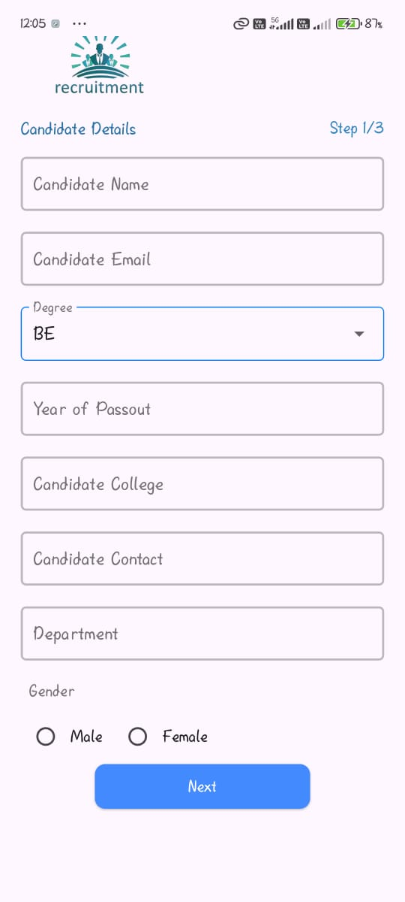
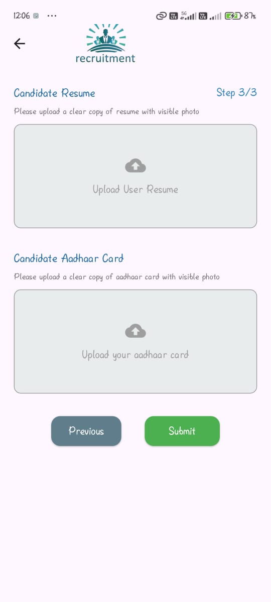

# Candidate Sign-In App

**Candidate Sign-In App** is a Flutter application that allows candidates to register their details securely before joining. It collects information via a form and stores it in a backend database.

---

## 🚀 Features
- **Candidate Registration:** A secure Sign-In page for candidates to fill in their details.
  - Input Fields: Name, Email, Degree, College, Contact, Department, etc.
  - Form Validation: Ensures all required fields are filled correctly.
  - Submission Feedback: Shows success or error messages after form submission.
- **Intuitive UI:** Simple and easy-to-use interface for all users.
- **Responsive Design:** Works on different screen sizes.

---

## 📸 Screenshots

**Sign in-01:**  


**Sign in-02:**  


**Sign in-03:**  


**Sign in-04:**  


## 💻 Installation

1. Clone the repository:
   ```bash
   git clone https://github.com/Vhkrish03/signin_app.git
2. Navigate to the project folder:
   ```bash
   cd CandidateSignInApp
3. Install dependencies:
   ```bash
   flutter pub get
4. Run the app:
   ```bash
   flutter run

